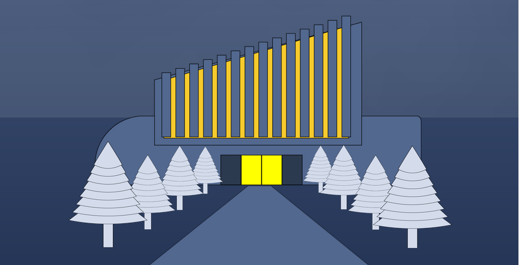
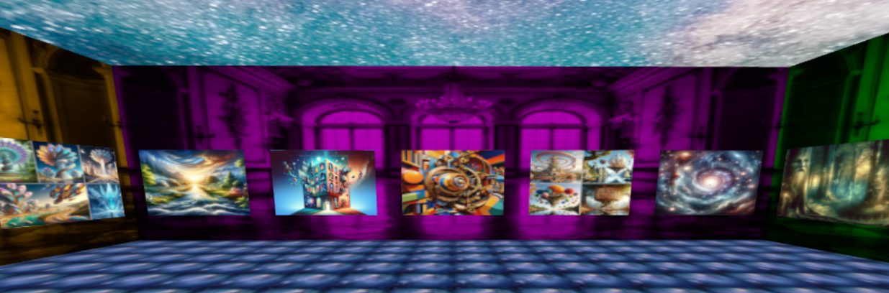
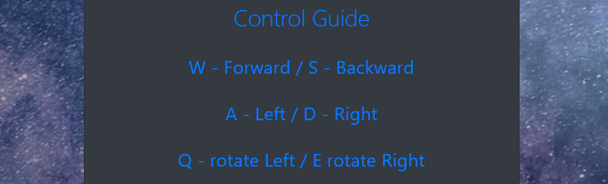

# Museum-of-Imagination

Dear friends, followers, and enthusiasts,
Welcome to the wonderful world of imagination and creation!  We invite you to explore, provide feedback, and recreate as you wish. Happy coding!

**Technology Stack**

This website is built using
 HTML5, CSS, SCSS, Bootstrap, and THREE.js.

## Installation

**Prerequisites:**

- Node.js: Essential for running JavaScript outside the browser and managing project dependencies.
- A code editor like VSCode (or your preferred editor).

**Download links:**
- [Node.js](https://nodejs.org)
- [VSCode](https://code.visualstudio.com/Download)

**Setting up:**

1. Clone or download the zip file from GitHub (`<> Code` button).

2. Open your terminal and navigate to the project directory.

3. Run `npm install` to install all dependencies. This will create a "node_modules" folder in your project directory.
```bash
  npm install
```
4. Start the local server by running `npx vite`. You'll see the local URL for the project.
```bash
  npx vite
```

You will see the URL address and the info help.

Ctrl - Click on local server. 
 ```

 VITE v5.0.10  ready in 359 ms

  ➜  Local:   http://localhost:5173/
  ➜  Network: use --host to expose
  ➜  press h + enter to show help

```









## Visit our [ Museum Of Imagination](https://cameronrosencutter.github.io/Museum-of-Imagination/index.html) 

Please Feel Free to connect with any one of us at our socials linked below!

## Authors

- Cameron Rosencutter [Github](https://github.com/CameronRosencutter)
- Eve Baker [Github](https://github.com/EveBaker)
- Crystal Carrillo [Github](https://github.com/CKCarr) [linkedIn](https://www.linkedin.com/in/crystal-carrillo/)


